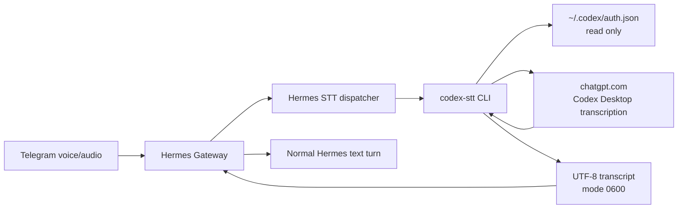
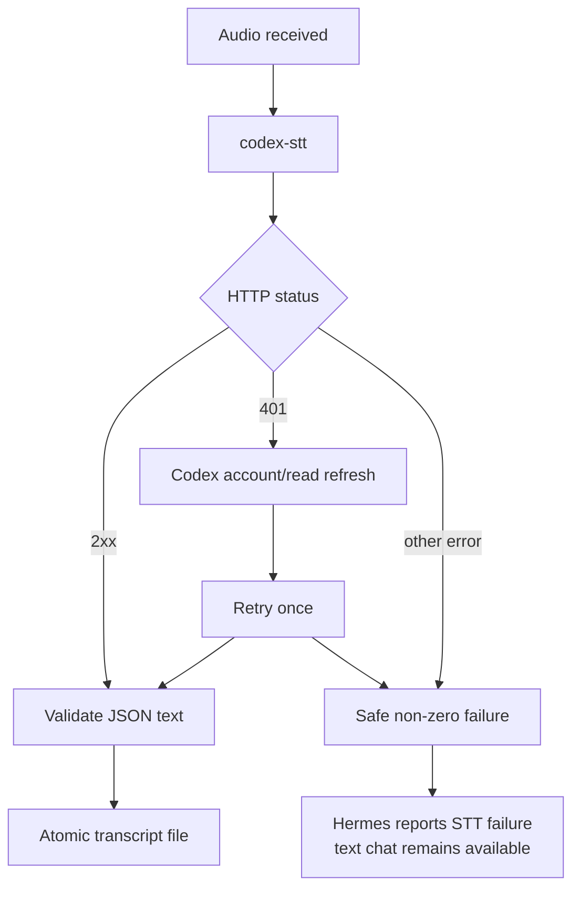

# Архитектура

## Назначение

`hermes-codex-stt` преобразует один локальный аудиофайл в текст. Это
изолированный адаптер между штатным command-provider интерфейсом Hermes Agent
и внутренним транскрипционным потоком Codex Desktop.



## Границы

### Hermes

Hermes отвечает за:

- получение Telegram-файла;
- вызов команды с `{input_path}` и `{output_path}`;
- чтение результата;
- отображение распознанного текста;
- последующий обычный агентский turn.

Код Hermes не патчится.

### Bridge

Bridge отвечает за:

- валидацию входного файла и его размера;
- чтение текущей Codex OAuth-сессии;
- прямую загрузку исходного аудио;
- один refresh и повтор после HTTP 401;
- проверку формата ответа;
- атомарную запись результата с mode `0600`;
- безопасную ошибку без credential material.

Bridge не сохраняет свою копию аудио, токенов или account ID.

### Codex

Codex CLI отвечает только за первичный login и обновление истёкшей OAuth-сессии.
Realtime app-server не используется для транскрипции.

Текущая реализация требует file-based credential storage. Codex keyring нельзя
прочитать напрямую, а внутренний transcription endpoint требует bearer token.
Если Codex перестанет поддерживать безопасный file-based flow, bridge должен
остановиться, а не извлекать credentials обходным способом.

## Почему command provider

Command provider является наименьшей устойчивой точкой интеграции:

- нет отдельного процесса или порта;
- нет Hermes plugin API;
- нет MCP;
- отказ STT не останавливает обычный чат;
- CLI можно проверить независимо от gateway;
- обновление bridge не требует изменения Hermes core.

Официальная документация Hermes предлагает Python plugin для интеграций,
которым OAuth-refresh или streaming нужны как часть provider API. Здесь refresh
инкапсулирован внутри самостоятельного однокомандного CLI, поэтому command
provider остаётся меньшей и лучше изолированной границей. Если появятся
streaming chunks, provider metadata или интерактивный setup, архитектуру
следует пересмотреть в пользу plugin.

## Поток ошибки



## Данные

| Данные | Читаются | Передаются | Сохраняются bridge |
| --- | ---: | ---: | ---: |
| Входное аудио | да | `chatgpt.com` | нет |
| OAuth access token | да | `chatgpt.com` | нет |
| Codex account ID | да | `chatgpt.com` | нет |
| Refresh token | напрямую нет | через Codex CLI | нет |
| Транскрипт | да | Hermes | только в заданный output |

## Production ownership

Рекомендуемая граница:

```text
/opt/hermes-codex-stt/       root/admin owned, runtime read+execute
~/.codex/auth.json           hermes owned, mode 0600
Hermes config                hermes owned, mode 0600
audio cache                  hermes owned
transcript temp output       hermes owned, mode 0600
```

User-writable development checkout допустим для разработки, но не является
предпочтительным production executable path для credential-handling кода.
