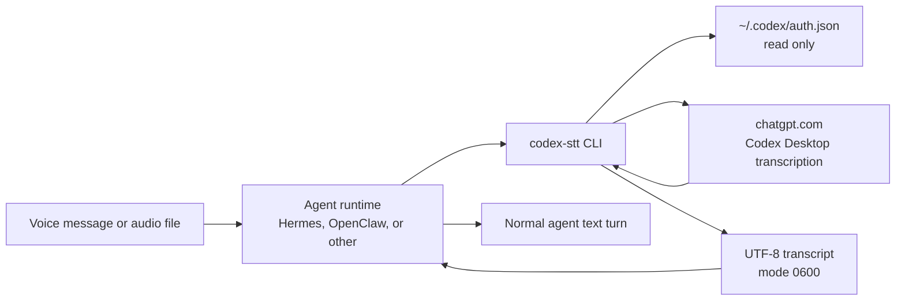
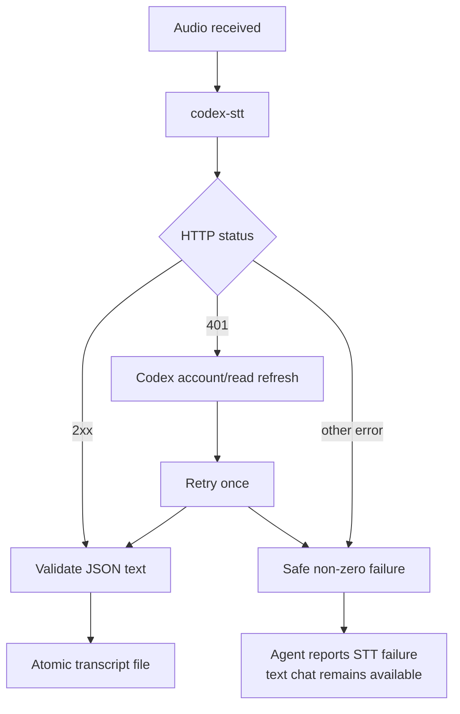

# Architecture

**English** | [Русский](ARCHITECTURE.ru.md)

## Purpose

`codex-stt-bridge` converts one local audio file into text. It is an isolated
adapter between an agent runtime's local-command interface and the internal
Codex Desktop transcription flow.



## Responsibilities

### Agent runtime

The agent runtime is responsible for:

- receiving or locating the audio file;
- invoking the CLI with an input path and optionally an output path;
- reading the result;
- showing the recognized text;
- continuing with a normal agent turn.

Hermes uses a command-type STT provider with `{input_path}` and
`{output_path}`. OpenClaw uses a media CLI with `{{MediaPath}}` and reads
stdout. Neither agent core is patched.

### Bridge

The bridge is responsible for:

- validating the input file and size;
- reading the current Codex OAuth session;
- uploading the original audio directly;
- refreshing once and retrying once after HTTP 401;
- validating the response shape;
- writing the result atomically with mode `0600`;
- failing safely without exposing credential material.

The bridge does not retain its own copy of audio, tokens, or the account ID.

### Codex

Codex CLI is responsible only for initial login and refreshing an expired
OAuth session. Its real-time app server is not used for transcription.

The current implementation requires file-based credential storage. The bridge
cannot read the Codex keyring directly, while the internal transcription
endpoint requires a bearer token. If Codex stops supporting a safe file-based
flow, the bridge must stop rather than extract credentials through an
unofficial workaround.

## Why a local CLI

A local CLI is the smallest stable integration boundary:

- no separate process or port;
- no dependency on an agent plugin API;
- no MCP server;
- an STT failure does not stop normal text chat;
- the CLI can be checked independently from the gateway;
- updating the bridge does not require changing the agent core.

Hermes and OpenClaw both support bounded local commands for transcription.
Refresh is encapsulated inside a deterministic one-command CLI, so this
remains a smaller and better-isolated boundary than a custom plugin.
Reconsider a plugin if streaming chunks, provider metadata, or interactive
setup become necessary.

## Failure flow



## Data flow

| Data | Read | Transmitted | Stored by bridge |
| --- | ---: | ---: | ---: |
| Input audio | yes | `chatgpt.com` | no |
| OAuth access token | yes | `chatgpt.com` | no |
| Codex account ID | yes | `chatgpt.com` | no |
| Refresh token | not directly | through Codex CLI | no |
| Transcript | yes | agent runtime | stdout or the requested output path |

## Production ownership

Recommended boundary:

```text
/opt/codex-stt-bridge/       root/admin owned, runtime read+execute
~/.codex/auth.json           agent user owned, mode 0600
agent config                 agent user owned, mode 0600
audio cache                  agent user owned
transcript temp output       agent user owned, mode 0600
```

A user-writable checkout is acceptable for development, but it is not the
preferred production executable path for code that handles credentials.
