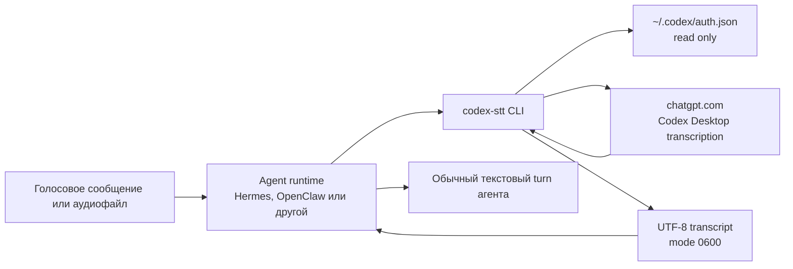
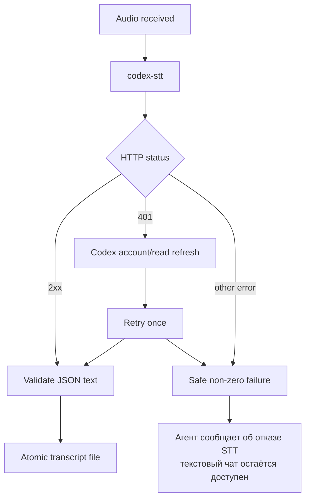

# Архитектура

[English](ARCHITECTURE.md) | **Русский**

## Назначение

`codex-stt-bridge` преобразует один локальный аудиофайл в текст. Это
изолированный адаптер между интерфейсом локальных команд agent runtime и
внутренним транскрипционным потоком Codex Desktop.



## Границы

### Agent runtime

Agent runtime отвечает за:

- получение или поиск аудиофайла;
- вызов CLI с input path и при необходимости output path;
- чтение результата;
- отображение распознанного текста;
- последующий обычный агентский turn.

Hermes использует command-type STT provider с `{input_path}` и
`{output_path}`. OpenClaw использует media CLI с `{{MediaPath}}` и читает
stdout. Код обоих агентов не патчится.

### Bridge

Bridge отвечает за:

- валидацию входного файла и его размера;
- чтение текущей Codex OAuth-сессии;
- прямую загрузку исходного аудио;
- один refresh и повтор после HTTP 401;
- проверку формата ответа;
- атомарную запись результата с mode `0600`;
- безопасную ошибку без credential material.

Bridge не сохраняет свою копию аудио, токенов или account ID.

### Codex

Codex CLI отвечает только за первичный login и обновление истёкшей OAuth-сессии.
Realtime app-server не используется для транскрипции.

Текущая реализация требует file-based credential storage. Codex keyring нельзя
прочитать напрямую, а внутренний transcription endpoint требует bearer token.
Если Codex перестанет поддерживать безопасный file-based flow, bridge должен
остановиться, а не извлекать credentials обходным способом.

## Почему локальный CLI

Локальный CLI является наименьшей устойчивой точкой интеграции:

- нет отдельного процесса или порта;
- нет зависимости от agent plugin API;
- нет MCP;
- отказ STT не останавливает обычный чат;
- CLI можно проверить независимо от gateway;
- обновление bridge не требует изменения agent core.

Hermes и OpenClaw поддерживают ограниченные локальные команды для
транскрипции. Refresh инкапсулирован внутри самостоятельного однокомандного
CLI, поэтому эта граница меньше и лучше изолирована, чем custom plugin. Если
появятся streaming chunks, provider metadata или интерактивный setup,
архитектуру следует пересмотреть в пользу plugin.

## Поток ошибки



## Данные

| Данные | Читаются | Передаются | Сохраняются bridge |
| --- | ---: | ---: | ---: |
| Входное аудио | да | `chatgpt.com` | нет |
| OAuth access token | да | `chatgpt.com` | нет |
| Codex account ID | да | `chatgpt.com` | нет |
| Refresh token | напрямую нет | через Codex CLI | нет |
| Транскрипт | да | agent runtime | stdout или заданный output |

## Production ownership

Рекомендуемая граница:

```text
/opt/codex-stt-bridge/       root/admin owned, runtime read+execute
~/.codex/auth.json           agent user owned, mode 0600
agent config                 agent user owned, mode 0600
audio cache                  agent user owned
transcript temp output       agent user owned, mode 0600
```

User-writable development checkout допустим для разработки, но не является
предпочтительным production executable path для credential-handling кода.
